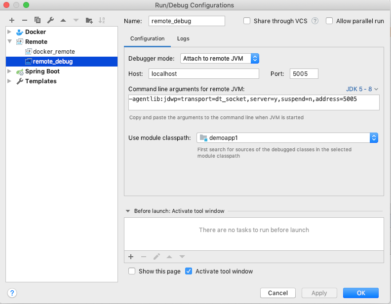

# 개발 활용 소개


## (1) 데이타베이스 연동
  - mysql
      - https://hub.docker.com/_/mysql


Running as an arbitrary user

```
$ mkdir data

$ ls -lnd data
drwxr-xr-x 2 1000 1000 4096 Aug 27 15:54 data

$ docker run -v "$PWD/data":/var/lib/mysql --user 1000:1000 --name some-mysql -e MYSQL_ROOT_PASSWORD=my-secret-pw -d mysql:ta
```


Creating database dumps

```
$ docker exec some-mysql sh -c 'exec mysqldump --all-databases -uroot -p"$MYSQL_ROOT_PASSWORD"' > /some/path/on/your/host/all-databases.sql
```


Restoring data from dump files

```
$ docker exec -i some-mysql sh -c 'exec mysql -uroot -p"$MYSQL_ROOT_PASSWORD"' < /some/path/on/your/host/all-databases.sql
```


## (2) 자바 개발툴 연동

참고 :

- https://github.com/docker/labs/tree/master/developer-tools/java


자바 샘플 

- https://github.com/doojin88/docker/tree/master/examples/demoapp1


리모트 디버깅 

- 참고
  - https://docs.oracle.com/javase/8/docs/technotes/guides/jpda/conninv.html#Invocation

- 프로그램 실행 :

- ```
  $ java -agentlib:jdwp=transport=dt_socket,server=y,suspend=n,address=5005 -jar target/demoapp1-1.0.jar

  ```
  
- IDE 디버그 연결 :  

<div align='center'></div>


Docker 를 이용한 디버깅 

- Dockerfile

- ```
  FROM openjdk:8u212-jdk
  RUN mkdir -p /app
  COPY target/demoapp1-1.0.jar /app
  WORKDIR /app
  
  #COPY docker/entrypoint.sh /usr/local/bin/
  #RUN ln -s usr/local/bin/entrypoint.sh /entrypoint.sh # backwards compat
  #ENTRYPOINT ["entrypoint.sh"]
  
  EXPOSE 8888 5005
  
  CMD ["java","-agentlib:jdwp=transport=dt_socket,server=y,suspend=n,address=5005","-Djava.security.egd=file:/dev/./urandom","-jar","/app/demoapp1-1.0.jar"]
```
  
  


<br/>

